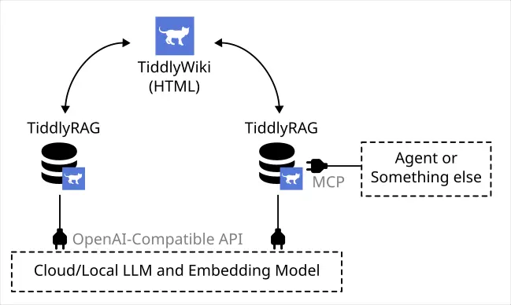
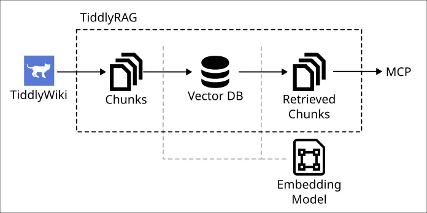

# TiddlyRAG POC: Basic Use Case

## What is TiddlyRAG?

It's microservice used to providing knowledge about certain domain, and used by a RAG system.

## What's the problems that TiddlyRAG trying solve?

### Reuse RAG preprocessed knowledge

As is known to everyone (consider you are read this RAG related project, I assume so), RAG would chunking text from input materials, some systems cutting it good and some systems bad, the chunking quality it's highly affect performance of the RAG system.

So what if we can transfer knowledge (text chunk) between RAD databases?

### Better Human Usability

My definition of `llm.txt` is: a plain text file prepared for LLM, used to providing context.

There alot of tools can create, generate, providing `llm.txt`, such as [repomix](https://github.com/yamadashy/repomix), [markitdown](https://github.com/microsoft/markitdown), Context7...put the chunking issue that I mentioned before beside, `llm.txt` it's very hard to read for human.

Data cleansing is 101 of ETL,the truth of source for RAG can't easily been process by human, that's a problem.

### TiddlyWiki

But glad we don't need to reinvent wheel, a perfect solution for knowledge payload; an alternative of `llm.txt` already exist: TiddlyWiki.

TiddlyWiki is a non-linear personal web notebook, more specificly, it's a single HTML containing both program and data, you can open it as SPA and read or edit notes.

The philosophy of TiddlyWiki is very similar to Zettelkasten method, you make many Tiddler (card) in short of conent, and link them. So it present the chunking process naturally. The other hand "It's SPA" solving the problem human can't read or edit data easily.

Plus, links between Tiddlers implicitly containing Graph information, they would be useful when you want to using Graph based RAG strategy.



## What's this POC providing?



This POC providing a HTTP API used to upload a TiddlyWiki into database, only Tiddlers been tag as `knowledge` would been imported.

Also providing a simple MCP interface allowed you integrate with other LLM tools, the interface design is inspired by Context7.


## Usage

```yaml
services:
  tiddlyrag:
    image: ghcr.io/flyskypie/tiddlyrag-poc:type-a-0.1.0
    ports:
      - 8089:3000
    environment:
      - DATABASE_HOST=pgvector
      - DATABASE_PORT=5432
      - POSTGRES_USER=postgres
      - POSTGRES_PASSWORD=postgres
      - POSTGRES_DB=postgres

      - EMBEDDING_BASE_PATH=https://openrouter.ai/api/v1/embeddings
      - EMBEDDING_MODEL=qwen/qwen3-embedding-4b
      - EMBEDDING_API_KEY=

      - COMMON_LLM_MODEL=qwen/qwen3.5-27b
      - COMMON_LLM_BASE_PATH=https://openrouter.ai/api/v1
      - COMMON_LLM_API_KEY=
      
      - TIDDLYWIKI_TEMPLATE_PATH=/tiddlywiki-template
    volumes:
      - ./tiddlywiki-template:/tiddlywiki-template
```

and open http://localhost:8089/docs

### Tiddlywiki Template

You can setup plugins or tidders as base TiddlyWiki:

```
└── tiddlywiki-template
    ├── plugins
    ├── public
    ├── tiddlers
    └── tiddlywiki.info
```

This used for the endpoint `GET /wikis/{wiki}`.

## More Information

If you interesting about the idea, here are related materials, some of them are blog posts I wrote before.

- [FlySkyPie/tiddlyrag-planning](https://github.com/FlySkyPie/tiddlyrag-planning) (Mandarin)
  - The GitHub repo used for planning TiddlyRAG.
- [ODDD](https://flyskypie.github.io/microproject-wikis/oddd.html) (Mandarin)
  - A TiddlyWiki talking about ODDD (ontology-domain driven design), which a methodology would using TiddlyRAG as infrastructure.
- [2025-10-06 a idea about using tiddlywiki as llms.txt](https://flyskypie.github.io/blog/2025-10-06_a-idea-about-using-tiddlywiki-as-llmstxt/) (Manderin)
  - First pmy ublic post talking about the idea.
- [2026-04-20 Freedom is not free in LLM era](https://flyskypie.github.io/posts/2026-04-20_freeson-isnt-free-in-llm-era/) (Manderin)
  - One of philosophy of mine is what drives me to invest effort into RAG systems.
- [2026-03-17 software growing trap with vibe coding](https://flyskypie.github.io/posts/2026-03-17_software-growing-trap/) (Manderin)
  - Why create RAG to stored domain knowledge is important.
- [2025-09-09 LLM and robotic arm](https://flyskypie.github.io/posts/2025-09-09_llm-and-robot-arm/) (Manderin)
