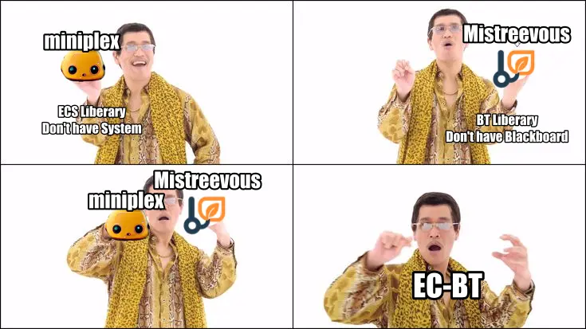

  
  

    <b>POC: EC-BT (Entity-Component Behavior Tree) Agent</b>
  

## What's TiddlyRAG?

Please check [the planning repo](https://github.com/FlySkyPie/tiddlyrag-planning).

## What's this POC providing?

- Behavior Tree: Flexibility to implement strategy without change code.
- Entity-Component: Better data organization compare to blackboard.
- Inspector: Visualizer BT, it's important for understanding BT and debugging.
- Weak Clean Architecture: Isolate NestJS, WebSocket Session, BT and EC logics.
- `ExplodeFolderDepthlyNode` and `ExplodeFolderWidelyNode` action node is implemented, easily change traversal behavior by update BT.

## Demo Video

[demo.webm](https://github.com/user-attachments/assets/d17b5b50-d262-4fbc-ae81-8b45a6f29298)

## Credit

This POC won't exist without these two libraries.

- [hmans/miniplex](https://github.com/hmans/miniplex)
- [nikkorn/mistreevous](https://github.com/nikkorn/mistreevous)

(Sorry, I just can't help myself)
